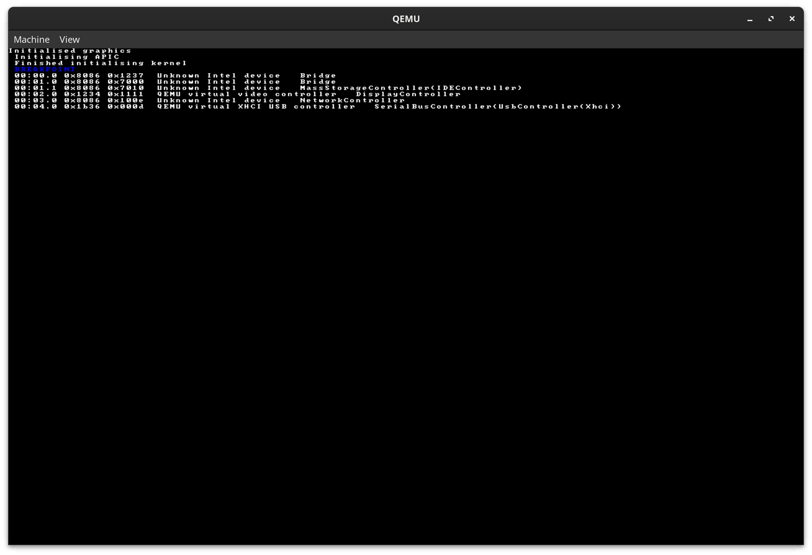
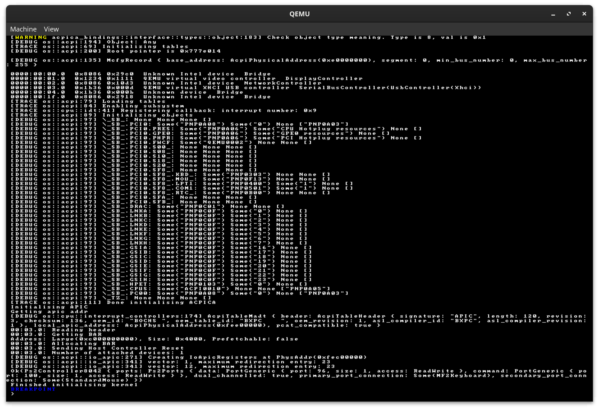

# Rust OS (working title)

An experimental operating system written in Rust, using the bootloader crate for interacting with BIOS / UEFI.

## Getting Started

The project is split into two crates. The kernel code is in `kernel/`, and the code to build, package, and optionally run the kernel is in `kernel-builder/`. To build the kernel, `cd` into `kernel-builder/` and run `cargo run`. This will build the kernel, and the kernel images will be generated at `kernel/images/`. These images can be copied to a USB drive with `dd` to run on real hardware, or run with qemu.

Alternatively, run `cargo run -- --run` to run the kernel in qemu after building it (note the `--` to separate the argument to cargo from the arguments to the kernel builder). To see a list of all possible arguments, run `cargo run -- --help`.

If you are using vscode, the config files in `.vscode` set up a launch config to debug the kernel, but this requires the "Native Debug" extension for vscode. 

## Features

The OS currently has very few user-facing features, as I am working on hardware support (e.g. PCI, USB) before things like processes and syscalls.

Current features:  
 - Basic software text rendering for `print!` and `println!`
 - Keyboard input using interrupts (this relies on an emulated PS/2 keyboard, so it won't work on all hardware)
 - Kernel heap allocator
 - Basic PCI device enumeration support
 - Basic ACPI support using Intel's ACPICA library, including:
   - Enumerating devices
   - Powering off the system

## Features In Development

- Further ACPI support using the ACPICA C library. I am writing my own rust bindings to this library as no existing bindings exist. The source code for these bindings are [here](https://github.com/MarkRoss470/acpica-rust-bindings)
- XHCI support for interacting with USB devices. This is currently blocked by support for ACPI as this is needed to handle PCI interrupts, which is necessary to support XHCI

## Screenshots

Enumerating PCI devices:

Enumerating ACPI devices:

## Credits

 * JDH, whose [Tetris OS](https://www.youtube.com/watch?v=FaILnmUYS_U) inspired me to look into operating systems
 * Philipp Oppermann, whose [blog](https://os.phil-opp.com/) formed the basis of this project.